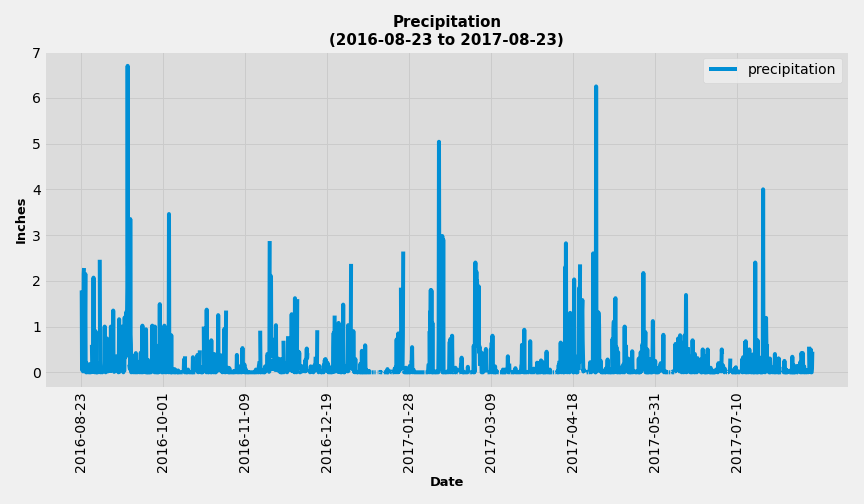
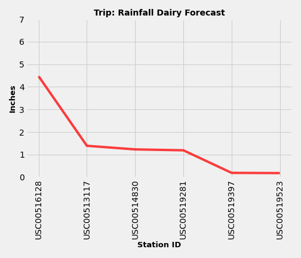

# Honolulu, Hawaii Climate Analysis

## Background

Holiday vacation in Honolulu, Hawaii! To make a wonderful trip, let's look at the climate. The climate analysis will focus on the last 12 months from the last date of the dataset and the most active station in Honolulu. The analysis will be based on the [Hawaii Sqlite file](Resources/hawaii.sqlite) and accompanied by Jupyter Notebook. Also, designing a Flask API based on the climate analysis queries that will be developed. 

## Climate Analysis and Exploration

Click here to view [Climate Analysis Method](https://nbviewer.jupyter.org/github/abpuccini/sqlalchemy-challenge/blob/main/climate_honolulu.ipynb).   

### Precipitation Analysis

As the graph presented below, it shows that from August 2016 to August 2017 the high number of precipitation is in September 2016, February 2017, April 2017 and July 2017.

    

---
### Station Analysis

There are 9 stations available in this dataset. The most active station is station USC00519281: WAIKIKI 717.2, HI, US. The station analysis will be based on the most active station in Honolulu, Hawaii. The most active station is the station with the highest number of observations.

As the graph presented below, it shows that the most frequent temperature at station USC00519281 is approximately between 75 to 76 fahrenheit degrees (F).

    

---
### Climate App

Time to plan the holiday vacation! Download the [climate app](app.py), open Terminal from the folder that you have stored climate app, run `python app.py` and open the route in your browser that is popped up. Here is the available route.

- To view the precipitation data > /api/v1.0/precipitation
- To view the station information > /api/v1.0/stations
- To view the most active station temperature observations > /api/v1.0/tobs
- To view the minimum, maximum and average temperature from specific date > /api/v1.0/start=YYYY-MM-DD
- To view the minimum, maximum and average temperature from specific date range > /api/v1.0/start=YYYY-MM-DD/end=YYYY-MM-DD

*Note: The format for date will be YYYY-MM-DD, i.e. 2016-08-23.*

---
### June and December Temperature Analysis

The average temperature in June and December are 74.94 and 71.04 respectively. By running unpaired t-test, the *p* value equals 0.00 indicates that the mean of temperature for both months is significantly different. 

    

*Note*: Applied unpaired t-test due to the comparison of the means of different group. The temperature was observed in the different times of year and different stations.

---
### Vacation Dates and Temperature Forecast

The vacation dates will be between 2017-12-28 to 2018-01-03. Therefore, the available date in the dataset to be applied to forecast the climate will be between 2016-12-28 to 2017-01-03. As the graph presented below, the maximum temperature is 77F, the minimum temperature is 62F and the average temperature is 69.81F. The bar graph is plotted based on the average temperature. The error bar is plotted based on the differences between max and min temperature. In other words, it means that the temperature could be between 68F to 77F.

    

---
### Trip: Daily Rainfall Average

Forecasting the rainfall for the trip by applying the date in the previous analysis. The station with the lowest rainfall is station ID USC00519523: WAIMANALO EXPERIMENTAL FARM. The analysis excluded the station with no data which is station ID USC00517948. As the result, the dairy rainfall averager could be presented as the graph below.

<table align=center>
    <tr>
        <td align=center></td>
    </tr>
    <tr>
        <td align=center></td>
    </tr>
 </table>

---
### Trip: Dairy Temperature

As the presented graph below, it illustrates the minimum, maximum and average temperature between 2016-12-28 to 2017-01-03 as the representative of the vacation dates which is 2017-12-28 to 2018-01-03. 

<table align=center>
    <tr>
        <td></td>
        <td></td>
    </tr>
 </table>

---

© [Atcharaporn B Puccini](https://www.linkedin.com/in/atcharaporn-puccini-233614118)